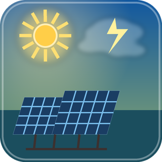

# ioBroker.pvforecast

Solar forecast adapter for ioBroker using Open-Meteo.

## What the adapter does

- Resolves a location either by city name or manual coordinates
- Retrieves hourly `global_tilted_irradiance` and `cloud_cover` from Open-Meteo
- Calculates hourly PV energy in `kWh` from irradiance, panel area and efficiency
- Publishes hourly forecast data for today and tomorrow
- Publishes daily totals for today plus the next 6 days
- Publishes current calendar week and current calendar month totals
- Exposes completeness flags when week or month values are only partially covered by the API

## Configuration

The adapter uses a JSON Config based admin UI with these fields:

- `locationMode`: `geocode` or `manual`
- `city`: default `Berlin`
- `countryCode`: optional ISO country code such as `DE`
- `latitude` and `longitude`: used in manual mode
- `timezoneMode`: `auto` or `manual`
- `timezone`: manual override, default `Europe/Berlin`
- `tiltDeg`: panel tilt in degrees, default `0`
- `azimuthDeg`: panel azimuth in degrees, default `0`
- `arrayAreaM2`: panel area in square meters, default `10`
- `panelEfficiencyPct`: panel efficiency in percent, default `22`

The adapter refreshes the forecast on startup and then hourly.
Each Open-Meteo refresh uses a 30 second request timeout and skips overlapping scheduled runs while a previous refresh is still active.

## Exposed states

- `info.connection`
- `info.lastUpdate`
- `info.lastError`
- `location.resolvedName`
- `location.countryCode`
- `location.latitude`
- `location.longitude`
- `location.timezone`
- `summary.today.energy_kwh`
- `summary.currentWeek.energy_kwh`
- `summary.currentWeek.complete`
- `summary.currentMonth.energy_kwh`
- `summary.currentMonth.complete`
- `forecast.daily.day0..day6.date`
- `forecast.daily.day0..day6.energy_kwh`
- `forecast.hourly.timestamps.<key>.*`
- `forecast.json.hourly`
- `forecast.json.daily`
- `forecast.json.summary`

The hourly `<key>` is derived from the local timestamp and gains a deterministic suffix when the same local hour occurs twice during the DST fallback change.

## Development

Important scripts:

| Script | Purpose |
| --- | --- |
| `npm run build` | Compile the TypeScript sources |
| `npm run check` | Run TypeScript type checking without emitting files |
| `npm run lint` | Run ESLint |
| `npm test` | Run project tests and package validation |
| `npm run coverage` | Run TypeScript coverage for `src/**/*.ts` with `c8` |
| `npm run test:integration` | Run the generated ioBroker integration tests |
| `npm run dev-server` | Start the local ioBroker dev server |

Project-specific unit tests live in `Tests/`. Template package and integration tests remain in `test/`.

## Notes

- `Solarvorhersage.ipynb` remains in the repository as a reference prototype.
- The adapter runtime itself is implemented in TypeScript under `src/`.

## Changelog

### **WORK IN PROGRESS**

- (Hagen) scaffolded the TypeScript adapter
- (Hagen) implemented Open-Meteo based PV forecast calculation and ioBroker state publishing

## License

MIT License

Copyright (c) 2026 Hagen <no-reply@example.com>
